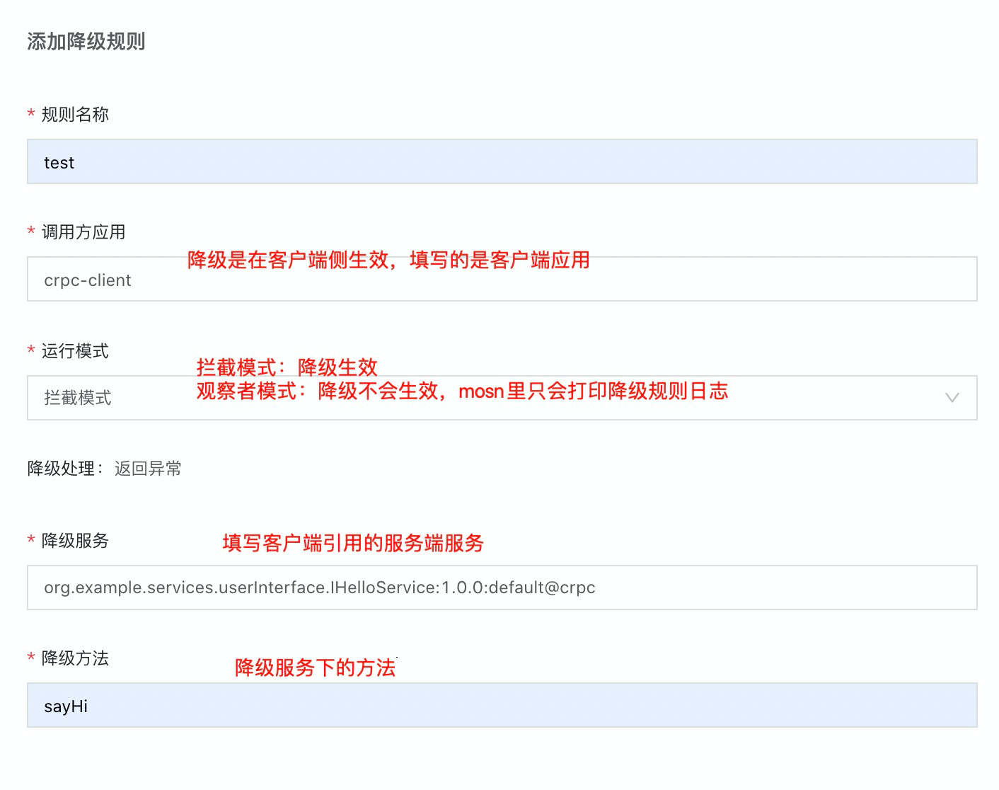
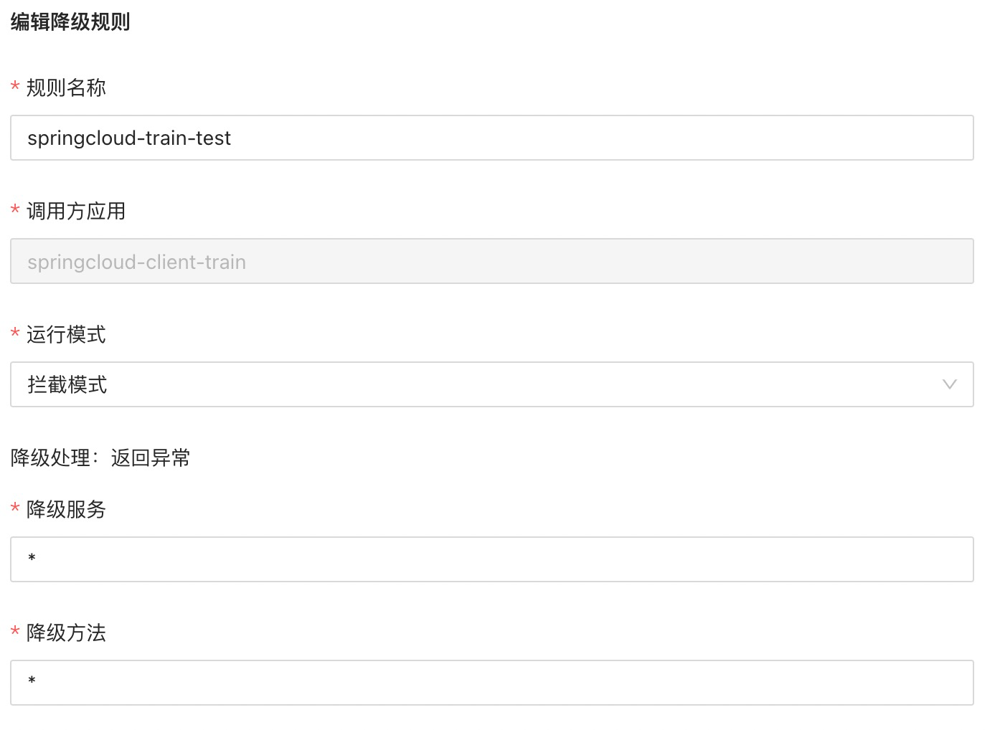

文档修订历史

| 版本号 | 作者                               | 备注     | 修订日期      |
|-----|----------------------------------| -------- |-----------|
| 0.1 | [檀少](https://github.com/Tanc010) | 初始版本 | 2022.5.10 |

<a name="LjFmL"></a>
## 2.7.3 服务降级
当服务器压力剧增的情况下，根据实际业务情况及流量，对某些不重要的服务，不处理或换种简单的方式处理，从而释放服务器资源以保证核心业务正常运作或高效运作。
### 功能简介
#### 降级原理
降级在客户端实现，当客户端在调用服务端时及时响应一个降级错误码，不会真正请求到服务端。目前支持服务级降级和方法级降级两种方式。实现流程如下：
#### 配置服务降级规则

1. 登录 MS控制台。
1. 在左侧菜单栏选择 **服务网格** > **服务治理**，然后单击 **服务降级 **页签**。**
1. 单击**添加降级规则**，然后配置以下参数：
   
   | **配置项** | **说明** |
   | --- | --- |
   | **规则名称** | 配置降级规则的名称。 |
   | **调用方应用** | 降级在客户端生效，这里填写或选择客户端应用。 |
   | **运行模式** | 设置降级规则的运行模式，取值如下：<ul><li>拦截模式：降级规则生效。<li>观察者模式：降级规则不会生效，只会在 MOSN 中打印日志。
      |
      | **降级服务** | 选择或填写客户端引用的服务端服务名称。星号（*）表示所有服务。 |
      | **降级方法** | 填写待降级的方法名。星号（*）表示所有方法。 |

4. 单击 **提交**，然后单击 **确定**。
4. 在降级规则列表中，将刚刚创建的规则状态修改为 **开**。
#### 编辑服务降级规则
您可以随时编辑已创建的服务降级规则，规则提交后实时生效。

1. 在 **服务降级** 页签，单击目标应用左侧的加号（+）。
1. 单击目标服务降级规则右侧的 **编辑**。
1. 按需求编辑服务降级规则后，单击 **提交**。
#### 删除服务降级规则
您可以删除已创建的服务降级规则，删除操作实时生效，请谨慎操作。

1. 在 **服务降级** 页签，单击目标应用左侧的加号（+）。
1. 单击目标服务降级规则右侧的 **删除**。
1. 单击 **确定**。
### 2.7.3.3 标准springcloud接入服务降级能力
降级粒度有三种

- 应用级降级：对整个客户端应用进行降级处理，由这个应用发出的任何请求都会被降级，服务和方法名需要填写 *
- 服务级降级：对客户端应用的引用的某一个服务进行降级：方法名填 *
- 方法级降级：对引用服务的某一个方法进行降级：填写具体方法名


#### 降级规则配置

降级规则开启后，进入客户端容器，多次调用客户端接口，可以看到所有的请求都被降级处理掉了
```powershell
kubectl exec -it springcloud-client-train-0 -c mosn-sidecar-container bash

## 访问8084端口的 hi 接口
curl 0:8084/reservations/hi?count=10
```

